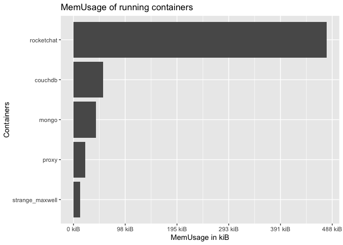

<!-- README.md is generated from README.Rmd. Please edit that file -->

# dockerstats

<!-- badges: start -->

<!-- badges: end -->

`{dockerstats}` is a small wrapper around `docker stats` that returns
the output of this command as an R data.frame.

Note that this package calls `system("docker stats")` so you should be
able to do this from your R command line. I’ll probably refactor that at
some point.

## Installation

You can install the released version of `{dockerstats}` from GitHub
with:

``` r
remotes::install_github("ColinFay/dockerstats")
```

## How to

``` r
library(dockerstats)
```

### dockerstats()

By default, `dockerstats()` returns the stats for running containers.

``` r
dockerstats()
#>      Container            Name           ID CPUPerc MemUsage MemLimit MemPerc
#> 1 144087c5fbaf         couchdb 144087c5fbaf    6.85 55.75MiB 12.69GiB    0.43
#> 2 5017ccedf5d5 strange_maxwell 5017ccedf5d5    0.10 12.09MiB 12.69GiB    0.09
#> 3 ca323ae39e42           proxy ca323ae39e42    0.00 21.75MiB 12.69GiB    0.17
#> 4 1c32d35562fb      rocketchat 1c32d35562fb    0.16 477.8MiB 12.69GiB    3.68
#> 5 9e9605a015d4           mongo 9e9605a015d4    2.23 42.73MiB 12.69GiB    0.33
#>     NetI   NetO BlockI BlockO PIDs         record_time extra
#> 1  150kB  203kB     0B     0B   30 2020-04-24 11:59:21      
#> 2 2.68MB 3.36MB     0B     0B    6 2020-04-24 11:59:21      
#> 3 9.73kB 1.84kB     0B     0B   11 2020-04-24 11:59:21      
#> 4  107MB 86.8MB     0B     0B   12 2020-04-24 11:59:21      
#> 5 86.6MB  107MB     0B     0B   55 2020-04-24 11:59:21
```

You can return stats for all containers (not just running)

``` r
dockerstats(all = TRUE)
#>       Container                    Name           ID CPUPerc MemUsage MemLimit
#> 1  144087c5fbaf                 couchdb 144087c5fbaf    1.61 55.75MiB 12.69GiB
#> 2  5017ccedf5d5         strange_maxwell 5017ccedf5d5    0.14 12.09MiB 12.69GiB
#> 3  a25f4ee0fb8d         elastic_khayyam a25f4ee0fb8d    0.00       0B       0B
#> 4  04e001a4b1db       sad_proskuriakova 04e001a4b1db    0.00       0B       0B
#> 5  3aa1aea8186e         elegant_dewdney 3aa1aea8186e    0.00       0B       0B
#> 6  40d8f43add75            dreamy_gould 40d8f43add75    0.00       0B       0B
#> 7  b30725ee216a        hardcore_ptolemy b30725ee216a    0.00       0B       0B
#> 8  579eb8936c44             zen_swanson 579eb8936c44    0.00       0B       0B
#> 9  3925b39043f4        hardcore_murdock 3925b39043f4    0.00       0B       0B
#> 10 ea30ec3c5424    affectionate_hypatia ea30ec3c5424    0.00       0B       0B
#> 11 0366f78dc8e9       wonderful_taussig 0366f78dc8e9    0.00       0B       0B
#> 12 baf592f3d6a1     suspicious_lovelace baf592f3d6a1    0.00       0B       0B
#> 13 deb4e2cc9664          loving_hypatia deb4e2cc9664    0.00       0B       0B
#> 14 2492225605f5          inspiring_bose 2492225605f5    0.00       0B       0B
#> 15 2cb8e121f57e           funny_lumiere 2cb8e121f57e    0.00       0B       0B
#> 16 840acbf622a7      recursing_robinson 840acbf622a7    0.00       0B       0B
#> 17 3ed5a6b4b8d0          clever_volhard 3ed5a6b4b8d0    0.00       0B       0B
#> 18 dbcf81982870   mystifying_hofstadter dbcf81982870    0.00       0B       0B
#> 19 841be05ca06f           nice_einstein 841be05ca06f    0.00       0B       0B
#> 20 bdac8ae662bd           rocketchating bdac8ae662bd    0.00       0B       0B
#> 21 ad640c7420ea     compassionate_ellis ad640c7420ea    0.00       0B       0B
#> 22 ea890803de3c           sleepy_colden ea890803de3c    0.00       0B       0B
#> 23 5cef479fec0e           boring_swartz 5cef479fec0e    0.00       0B       0B
#> 24 658ed62c82ed            elegant_pare 658ed62c82ed    0.00       0B       0B
#> 25 d74bd9004627          exciting_yalow d74bd9004627    0.00       0B       0B
#> 26 f5cb6430e103      gallant_lichterman f5cb6430e103    0.00       0B       0B
#> 27 f8c3f4b47931 heuristic_proskuriakova f8c3f4b47931    0.00       0B       0B
#> 28 1a8588105357          pedantic_booth 1a8588105357    0.00       0B       0B
#> 29 7c16ac79e629           focused_chaum 7c16ac79e629    0.00       0B       0B
#> 30 e2f0dc1dab14           boring_liskov e2f0dc1dab14    0.00       0B       0B
#> 31 7f3b0a08a7aa      stupefied_ishizaka 7f3b0a08a7aa    0.00       0B       0B
#> 32 194f087c356e       boring_mcclintock 194f087c356e    0.00       0B       0B
#> 33 7f575179ad72       flamboyant_sammet 7f575179ad72    0.00       0B       0B
#> 34 82b75a1bdbe8                    jack 82b75a1bdbe8    0.00       0B       0B
#> 35 5b1197c61bfb                   login 5b1197c61bfb    0.00       0B       0B
#> 36 ca323ae39e42                   proxy ca323ae39e42    0.00 21.75MiB 12.69GiB
#> 37 1c32d35562fb              rocketchat 1c32d35562fb    0.28   477MiB 12.69GiB
#> 38 9e9605a015d4                   mongo 9e9605a015d4    1.67 42.73MiB 12.69GiB
#>    MemPerc   NetI   NetO BlockI BlockO PIDs         record_time extra
#> 1     0.43  150kB  203kB     0B     0B   30 2020-04-24 11:59:23      
#> 2     0.09 2.68MB 3.36MB     0B     0B    6 2020-04-24 11:59:23      
#> 3     0.00     0B     0B     0B     0B    0 2020-04-24 11:59:23      
#> 4     0.00     0B     0B     0B     0B    0 2020-04-24 11:59:23      
#> 5     0.00     0B     0B     0B     0B    0 2020-04-24 11:59:23      
#> 6     0.00     0B     0B     0B     0B    0 2020-04-24 11:59:23      
#> 7     0.00     0B     0B     0B     0B    0 2020-04-24 11:59:23      
#> 8     0.00     0B     0B     0B     0B    0 2020-04-24 11:59:23      
#> 9     0.00     0B     0B     0B     0B    0 2020-04-24 11:59:23      
#> 10    0.00     0B     0B     0B     0B    0 2020-04-24 11:59:23      
#> 11    0.00     0B     0B     0B     0B    0 2020-04-24 11:59:23      
#> 12    0.00     0B     0B     0B     0B    0 2020-04-24 11:59:23      
#> 13    0.00     0B     0B     0B     0B    0 2020-04-24 11:59:23      
#> 14    0.00     0B     0B     0B     0B    0 2020-04-24 11:59:23      
#> 15    0.00     0B     0B     0B     0B    0 2020-04-24 11:59:23      
#> 16    0.00     0B     0B     0B     0B    0 2020-04-24 11:59:23      
#> 17    0.00     0B     0B     0B     0B    0 2020-04-24 11:59:23      
#> 18    0.00     0B     0B     0B     0B    0 2020-04-24 11:59:23      
#> 19    0.00     0B     0B     0B     0B    0 2020-04-24 11:59:23      
#> 20    0.00     0B     0B     0B     0B    0 2020-04-24 11:59:23      
#> 21    0.00     0B     0B     0B     0B    0 2020-04-24 11:59:23      
#> 22    0.00     0B     0B     0B     0B    0 2020-04-24 11:59:23      
#> 23    0.00     0B     0B     0B     0B    0 2020-04-24 11:59:23      
#> 24    0.00     0B     0B     0B     0B    0 2020-04-24 11:59:23      
#> 25    0.00     0B     0B     0B     0B    0 2020-04-24 11:59:23      
#> 26    0.00     0B     0B     0B     0B    0 2020-04-24 11:59:23      
#> 27    0.00     0B     0B     0B     0B    0 2020-04-24 11:59:23      
#> 28    0.00     0B     0B     0B     0B    0 2020-04-24 11:59:23      
#> 29    0.00     0B     0B     0B     0B    0 2020-04-24 11:59:23      
#> 30    0.00     0B     0B     0B     0B    0 2020-04-24 11:59:23      
#> 31    0.00     0B     0B     0B     0B    0 2020-04-24 11:59:23      
#> 32    0.00     0B     0B     0B     0B    0 2020-04-24 11:59:23      
#> 33    0.00     0B     0B     0B     0B    0 2020-04-24 11:59:23      
#> 34    0.00     0B     0B     0B     0B    0 2020-04-24 11:59:23      
#> 35    0.00     0B     0B     0B     0B    0 2020-04-24 11:59:23      
#> 36    0.17 9.73kB 1.84kB     0B     0B   11 2020-04-24 11:59:23      
#> 37    3.67  107MB 86.8MB     0B     0B   12 2020-04-24 11:59:23      
#> 38    0.33 86.6MB  107MB     0B     0B   55 2020-04-24 11:59:23
```

Or from a subset of containers:

``` r
dockerstats("mongo", "proxy")
#>   Container  Name           ID CPUPerc MemUsage MemLimit MemPerc   NetI   NetO
#> 1     mongo mongo 9e9605a015d4    1.74 42.83MiB 12.69GiB    0.33 86.6MB  107MB
#> 2     proxy proxy ca323ae39e42    0.00 21.75MiB 12.69GiB    0.17 9.73kB 1.84kB
#>   BlockI BlockO PIDs         record_time extra
#> 1     0B     0B   55 2020-04-24 11:59:26      
#> 2     0B     0B   11 2020-04-24 11:59:26
```

The `extra` param is used to add extra information to the recording,
which can be usefull is you want to tag the specific recording.

For example, here we mimic a connection on the `hexmake` container

``` r
system("docker run --name hexmake --rm -p 2811:80 colinfay/hexmake", wait = FALSE)
```

``` r
library(crrri)
chrome <- Chrome$new(
  bin = pagedown::find_chrome(), 
  debug_port = httpuv::randomPort()
)

client <- chrome$connect(callback = function(client) {
  Page <- client$Page
  Page$navigate(url = "http://localhost:2811")
  print({
    dockerstats::dockerstats("hexmake", extra = "Connection via chrome")
  })
})

chrome$close()
```

### dockerstats\_recurse

`dockerstats_recurse()` is a wrapper around `dockerstats()` that runs
every `every` seconds, calling the `callback` function everytime a loop
is completed.

By default, the callback is `print`, but you can define your own. For
example, this function will run the `dockerstats()` fun every 2 seconds
and save it to a file.

``` r
dockerstats_recurse(
  "hexmake",
  callback = function(res){
    print(
      paste("Mem usage: ", res$MemUsage)
    )
    write.table(
      res, 
      "dockerstats.csv", 
      append = TRUE, 
      col.names = FALSE, 
      row.names = FALSE, 
      sep = ","
    )
  }
)
```

As this is a pretty common use-case, a wrapper for this is implemented:

``` r
dockerstats_recurse(
  "hexmake",
  callback = append_csv("dockerstats.csv", print = TRUE)
)
```

Kill the container once done

``` r
system("docker kill hexmake")
```

## Byte conversions

To handle the `MemUsage` columns, expressed as `byte`, `{dockerstats}`
provides a series of functions to convert to byte, kib, mib or gib.

The unit is kept in `attr("units")` of the result

``` r
dock_stats <- dockerstats()
dock_stats$MemUsag
#> [1] "55.75MiB" "12.09MiB" "21.75MiB" "477.6MiB" "42.73MiB"
# Convert to kib
to_kib(dock_stats$MemUsag)
#> [1]  57088.00  12380.16  22272.00 489062.40  43755.52
#> attr(,"unit")
#> [1] "kib"
```

## How columns are transformed

  - `CPUPerc` and `MemPerc` are stripped from the trailing `%`, and are
    turned into numeric

  - `MEM USAGE / LIMIT` is splitted into two columns, `MemUsage` and
    \`MemLimit

  - `NET I/O` and `BLOCK I/O` are splitted into two columns,
    respectively `NetI` & `NetO`, and `BlockI` & `BlockO`

## Manipulate columns expressed in bite size

You can call `as_fs_byte()` from the `{fs}` package to manipulate the
columns which are expressed in bytes.

``` r
dock_stats <- dockerstats()

dock_stats$MemUsage <- to_kib(dock_stats$MemUsag)
```

``` r
library(ggplot2)
ggplot(
  dock_stats, 
  aes(
    reorder(Name, MemUsage), 
    MemUsage
  )
) + 
  geom_col() +
  scale_y_continuous(labels = scales::label_bytes(units = "kiB")) + 
  coord_flip() + 
  labs(
    title = "MemUsage of running containers", 
    y = "MemUsage in kiB", 
    x = "Containers"
  )
```


