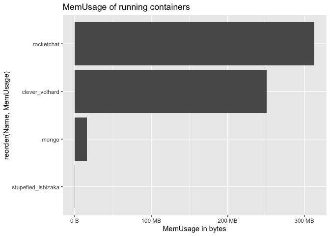

<!-- README.md is generated from README.Rmd. Please edit that file -->

# dockerstats

<!-- badges: start -->

<!-- badges: end -->

`{dockerstats}` is a small wrapper around `docker stats` that returns
the output of this command as an R data.frame.

Note that this package calls `system("docker stats")` so you should be
able to do this from your R command line. I’ll probably refactor that at
some point.

## Installation

You can install the released version of `{dockerstats}` from GitHubwith:

``` r
remotes::install_github("ColinFay/dockerstats")
```

## How to

``` r
library(dockerstats)
```

### dockerstats()

By default, `dockerstats()` returns the stats for running containers.

``` r
dockerstats()
#>      Container               Name
#> 1 b98c686fc095            hexmake
#> 2 7f3b0a08a7aa stupefied_ishizaka
#> 3 1c32d35562fb         rocketchat
#> 4 9e9605a015d4              mongo
#>                                                                 ID CPUPerc
#> 1 b98c686fc09546490b927f0bb743ef493cd82414a89842a26c1ca42c8aff8d5b    0.28
#> 2 7f3b0a08a7aa502657d0d5459f9cd412f0399825f8e15262bf47fe0cd4cc825d    0.00
#> 3 1c32d35562fbd442c75e132e4075f379fc2097293a1ab0b5361debf2d4ab74cb    1.39
#> 4 9e9605a015d4378283947ed16f547a8272039ec853b4962010203204d2c05167    2.23
#>   MemUsage MemLimit MemPerc   NetI   NetO BlockI BlockO PIDs
#> 1 174.8MiB 1.943GiB    8.78 29.7kB  566kB     0B     0B    4
#> 2   516KiB 1.943GiB    0.03 9.59kB     0B     0B     0B    1
#> 3 347.3MiB 1.943GiB   17.46  121MB 98.3MB     0B     0B   12
#> 4 21.04MiB 1.943GiB    1.06 98.1MB  120MB     0B     0B   55
#>           record_time extra
#> 1 2020-04-11 23:37:57      
#> 2 2020-04-11 23:37:57      
#> 3 2020-04-11 23:37:57      
#> 4 2020-04-11 23:37:57
```

You can return stats for all containers (not just running)

``` r
dockerstats(all = TRUE)
#>       Container                    Name
#> 1  b98c686fc095                 hexmake
#> 2  dbcf81982870   mystifying_hofstadter
#> 3  841be05ca06f           nice_einstein
#> 4  bdac8ae662bd           rocketchating
#> 5  ad640c7420ea     compassionate_ellis
#> 6  ea890803de3c           sleepy_colden
#> 7  5cef479fec0e           boring_swartz
#> 8  658ed62c82ed            elegant_pare
#> 9  d74bd9004627          exciting_yalow
#> 10 f5cb6430e103      gallant_lichterman
#> 11 f8c3f4b47931 heuristic_proskuriakova
#> 12 1a8588105357          pedantic_booth
#> 13 7c16ac79e629           focused_chaum
#> 14 e2f0dc1dab14           boring_liskov
#> 15 7f3b0a08a7aa      stupefied_ishizaka
#> 16 194f087c356e       boring_mcclintock
#> 17 7f575179ad72       flamboyant_sammet
#> 18 82b75a1bdbe8                    jack
#> 19 5b1197c61bfb                   login
#> 20 ca323ae39e42                   proxy
#> 21 1c32d35562fb              rocketchat
#> 22 9e9605a015d4                   mongo
#>                                                                  ID CPUPerc
#> 1  b98c686fc09546490b927f0bb743ef493cd82414a89842a26c1ca42c8aff8d5b    0.13
#> 2  dbcf81982870c42b73534e3e1e41ad5871c0dcb3d4f9b4b8a97b71f4d1bd5eb2    0.00
#> 3  841be05ca06f9b96fce842e426fc2d23a5ce968c898bd401ddcd7057ae790ac7    0.00
#> 4  bdac8ae662bd5c4b647fad89b73c95a66f84406a07d9e1c4e0db5a0eff33ad6b    0.00
#> 5  ad640c7420ea021453866e974666b7337885220238dadd3b717fa42bc51f3b26    0.00
#> 6  ea890803de3c6bf430c39b4c9e03ae79f18a01f453fe6794ca2d02882c2f905b    0.00
#> 7  5cef479fec0e5a8ab1b8940364ff4779e4abb2adfd2a9f8dbe1f6f470cb5d9c1    0.00
#> 8  658ed62c82edbb32979c2adac7ad75ce65b41bfb7044758e34c79d45804a6f31    0.00
#> 9  d74bd9004627efa518ea0fe669434fa6ccd2f86491e39311c9211bfb860839e2    0.00
#> 10 f5cb6430e103fc3c0e57942e8a96f84ffc55f4006cd089e1be5a82bfec808935    0.00
#> 11 f8c3f4b4793146069b336db2ec8d96732920eac759991138ba0695d05a8e2de6    0.00
#> 12 1a8588105357e77d1e284615d7461a259c41f654c5db66e3b8964fa5395a4d65    0.00
#> 13 7c16ac79e629e7d74137840876561733614aea265c4876c360160cd258e85d5f    0.00
#> 14 e2f0dc1dab146b1b0418f3cd620fdaa0ba40645aa822b10261e8ba221499aaa2    0.00
#> 15 7f3b0a08a7aa502657d0d5459f9cd412f0399825f8e15262bf47fe0cd4cc825d    0.00
#> 16 194f087c356e992778f8ddac61eeb4e4e107caee43af8c1d8072e6aad425f97a    0.00
#> 17 7f575179ad72079840887cd52ad0fe5a97313d4864414e35660c8740265351ff    0.00
#> 18 82b75a1bdbe8ce1750210646c02a4dd24c0113c162de2f58d6534c0b25e8b2f0    0.00
#> 19 5b1197c61bfba9614ccea0c69f9ae048e44e85ac0e64f36f240bc9220f962f5d    0.00
#> 20 ca323ae39e42d898417b019b2bf7f06feaf877d248cd71b9cad8eebc3f5e1126    0.00
#> 21 1c32d35562fbd442c75e132e4075f379fc2097293a1ab0b5361debf2d4ab74cb    0.12
#> 22 9e9605a015d4378283947ed16f547a8272039ec853b4962010203204d2c05167    2.15
#>    MemUsage MemLimit MemPerc   NetI   NetO BlockI BlockO PIDs
#> 1  174.8MiB 1.943GiB    8.78 29.7kB  566kB     0B     0B    4
#> 2        0B       0B    0.00     0B     0B     0B     0B    0
#> 3        0B       0B    0.00     0B     0B     0B     0B    0
#> 4        0B       0B    0.00     0B     0B     0B     0B    0
#> 5        0B       0B    0.00     0B     0B     0B     0B    0
#> 6        0B       0B    0.00     0B     0B     0B     0B    0
#> 7        0B       0B    0.00     0B     0B     0B     0B    0
#> 8        0B       0B    0.00     0B     0B     0B     0B    0
#> 9        0B       0B    0.00     0B     0B     0B     0B    0
#> 10       0B       0B    0.00     0B     0B     0B     0B    0
#> 11       0B       0B    0.00     0B     0B     0B     0B    0
#> 12       0B       0B    0.00     0B     0B     0B     0B    0
#> 13       0B       0B    0.00     0B     0B     0B     0B    0
#> 14       0B       0B    0.00     0B     0B     0B     0B    0
#> 15   516KiB 1.943GiB    0.03 9.59kB     0B     0B     0B    1
#> 16       0B       0B    0.00     0B     0B     0B     0B    0
#> 17       0B       0B    0.00     0B     0B     0B     0B    0
#> 18       0B       0B    0.00     0B     0B     0B     0B    0
#> 19       0B       0B    0.00     0B     0B     0B     0B    0
#> 20       0B       0B    0.00     0B     0B     0B     0B    0
#> 21 347.4MiB 1.943GiB   17.46  121MB 98.3MB     0B     0B   12
#> 22 21.19MiB 1.943GiB    1.06 98.2MB  120MB     0B     0B   55
#>            record_time extra
#> 1  2020-04-11 23:37:59      
#> 2  2020-04-11 23:37:59      
#> 3  2020-04-11 23:37:59      
#> 4  2020-04-11 23:37:59      
#> 5  2020-04-11 23:37:59      
#> 6  2020-04-11 23:37:59      
#> 7  2020-04-11 23:37:59      
#> 8  2020-04-11 23:37:59      
#> 9  2020-04-11 23:37:59      
#> 10 2020-04-11 23:37:59      
#> 11 2020-04-11 23:37:59      
#> 12 2020-04-11 23:37:59      
#> 13 2020-04-11 23:37:59      
#> 14 2020-04-11 23:37:59      
#> 15 2020-04-11 23:37:59      
#> 16 2020-04-11 23:37:59      
#> 17 2020-04-11 23:37:59      
#> 18 2020-04-11 23:37:59      
#> 19 2020-04-11 23:37:59      
#> 20 2020-04-11 23:37:59      
#> 21 2020-04-11 23:37:59      
#> 22 2020-04-11 23:37:59
```

Or from a subset of containers:

``` r
dockerstats("mongo", "proxy")
#>   Container  Name
#> 1     mongo mongo
#> 2     proxy proxy
#>                                                                 ID CPUPerc
#> 1 9e9605a015d4378283947ed16f547a8272039ec853b4962010203204d2c05167    2.74
#> 2 ca323ae39e42d898417b019b2bf7f06feaf877d248cd71b9cad8eebc3f5e1126    0.00
#>   MemUsage MemLimit MemPerc   NetI  NetO BlockI BlockO PIDs         record_time
#> 1 21.24MiB 1.943GiB    1.07 98.2MB 120MB     0B     0B   55 2020-04-11 23:38:01
#> 2       0B       0B    0.00     0B    0B     0B     0B    0 2020-04-11 23:38:01
#>   extra
#> 1      
#> 2
```

The `extra` param is used to add extra information to the recording,
which can be usefull is you want to tag the specific recording.

For example, here we mimic a connection on the `hexmake`
container

``` r
system("docker run --name hexmake --rm -p 2811:80 colinfay/hexmake", wait = FALSE)
```

``` r
library(crrri)
chrome <- Chrome$new(
  bin = pagedown::find_chrome(), 
  debug_port = httpuv::randomPort()
)

client <- chrome$connect(callback = function(client) {
  client
})

Page <- client$Page
Page$navigate(url = "http://localhost:2811")

dockerstats::dockerstats("hexmake", extra = "Connection via chrome")

chrome$close()
```

### dockerstats\_recurse

`dockerstats_recurse()` is a wrapper around `dockerstats()` that runs
every `every` seconds, calling the `callback` function everytime a loop
is completed.

By default, the callback is `print`, but you can define your own. For
example, this function will run the `dockerstats()` fun every 2 seconds
and save it to a file.

``` r
dockerstats_recurse(
  "hexmake",
  callback = function(res){
    print(
      paste("Mem usage: ", res$MemUsage)
    )
    write.table(
      res, 
      "dockerstats.csv", 
      append = TRUE, 
      col.names = FALSE, 
      row.names = FALSE, 
      sep = ","
    )
  }
)
```

As this is a pretty common use-case, a wrapper for this is implemented:

``` r
dockerstats_recurse(
  "hexmake",
  callback = append_csv("dockerstats.csv", print = TRUE)
)
```

## How columns are transformed

  - `CPUPerc` and `MemPerc` are stripped from the trailing `%`, and are
    turned into numeric

  - `MEM USAGE / LIMIT` is splitted into two columns, `MemUsage` and
    \`MemLimit

  - `NET I/O` and `BLOCK I/O` are splitted into two columns,
    respectively `NetI` & `NetO`, and `BlockI` & `BlockO`

## Manipulate columns expressed in bite size

You can call `as_fs_byte()` from the `{fs}` package to manipulate the
columns which are expressed in bytes.

Note that you’ll need to install the `{fs}` package (it’s not imported
by `{dockerstats}`).

``` r
dock_stats <- dockerstats()

sort(dock_stats$MemUsage)
#> [1] "174.8MiB" "21.34MiB" "347.3MiB" "516KiB"

dock_stats$MemUsage <- fs::as_fs_bytes(
  dock_stats$MemUsage
)
sort(dock_stats$MemUsage)
#> 516K  21.3M 174.8M 347.3M
```

``` r
library(ggplot2)
ggplot(
  dock_stats, 
  aes(
    reorder(Name, MemUsage), 
    MemUsage)
) + 
  geom_col() +
  scale_y_continuous(labels = scales::comma) + 
  coord_flip() + 
  labs(
    title = "MemUsage of running containers", 
    y = "MemUsage in bytes"
  )
```



``` r
system("docker kill hexmake")
```
